# CoOl JuMpInG GaMe (2D Video Game)

## How to View Files
Note: This will only view the program file (GDScript) contents and not be able to run the actual game or show the animations for objects. The actual gameplay will be shown during the project demonstration.

1. Download the Godot Game Engine in the link provided (standard version recommended): https://godotengine.org/download/windows 

2. Download the folder with Godot files to your computer (folder that was handed into URCourses)

3. When Godot is done downloading you can open it up

4. On the right hand side click “Import”
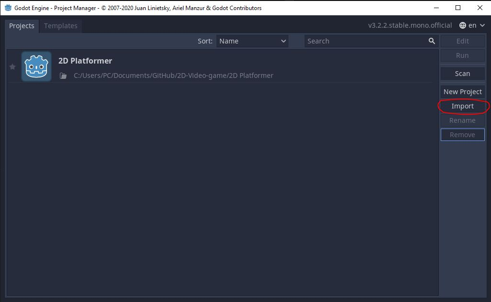

5. Browse for where you saved the Godot files
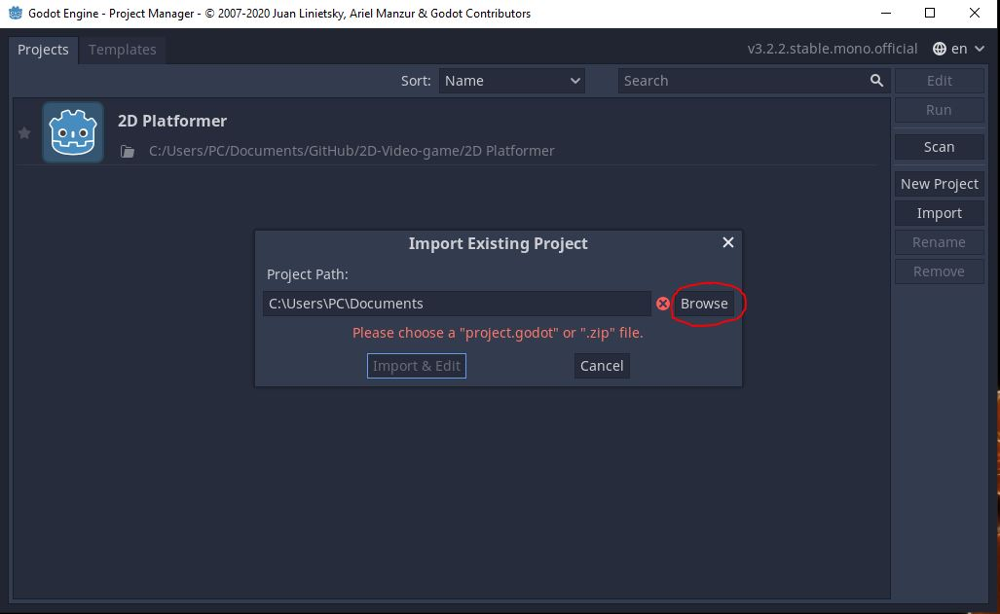

6. Choose the “project.godot” file and click “Import and Edit”. This is the file that will open up the Godot workspace:
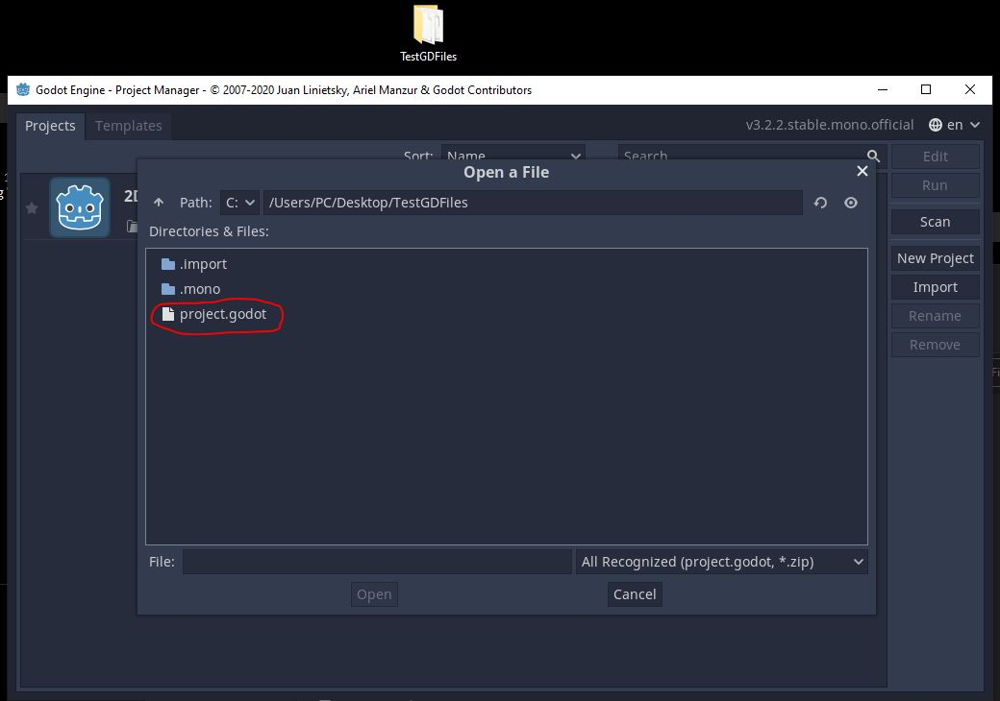

7. The workspace should open up. If you get an “Alert” message, click “OK”. That is just a scene (.tscn) with png assets that do not contain code so they will not be included in the program files.
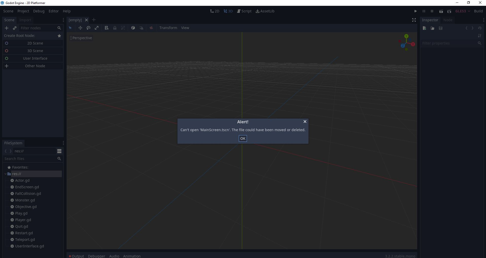

8. The GD files will be on the left hand side of the workspace

    

9. Right click on a .gd file and click “Open”. For example, right click on Player.gd and click "Open"
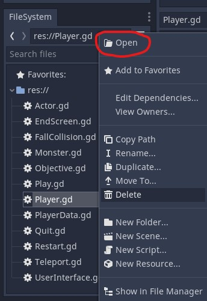

10. This should show the GDScript program contents. 
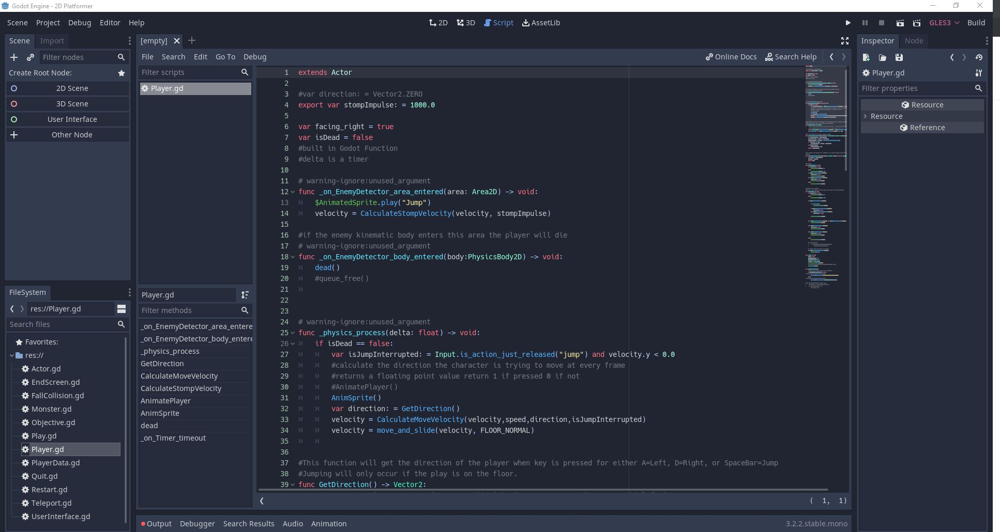

## List of GDScript (program) files
Screens/Menus:
- Play.gd 
- Quit.gd
- Restart.gd
- EndScreen.gd

Levels:
- Monster.gd
- Player.gd
- PlayerData.gd
- Teleport.gd
- Objective.gd
- FallCollision.gd
- UserInterface.gd 

Godot project:
- project.godot

## Purpose of the Project
Our 2D platform video game project was created in order to showcase the functional and quality requirements that are shown in a software engineering methodology

## Contents of Github Repo

* /2D Platformer
     * /.import - imported assets
     * /.mono
     * /.Assets
          * /Buttons - png images for buttons 
          * /EnemySprite - .png assets for the enemies
          * /Fonts - fonts used for texts
          * /LevelAssets - png assets for the level’s environment
          * /Sounds - .ogg files for sounds used 
          * /Sprites - .png assets for the player’s character
     * /Screen - .tscn for screens
     * /src
          * /Actors - the .tscn and .gd files for player and enemies
          * /Autoload - .gd and .tscn files for player’s data
          * /Levels - the .tscn and .tres files for the Levels
          * /Objects - .gd and .tscn files of objects in game
     * /UI_Stuff - .gd and .tscn files of user interface objects
          
* /README.md

(Types of files: GDScript files in .gd format, and scene files in .tscn format, tilesets in .tres format, sound files in .ogg format)

## Game Objective 

The player’s objective is to collect coins in the level and reach the teleport and the end in order to move on to the next level. Although, the player will have the added challenge to avoid/defeat enemies along their journey to collect the coins. User’s can defeat enemies by jumping on the enemies heads

## Characters

* Player's Character 
* Enemy characters
  - Green slime

## Controls

* A Key: moves player's character to the left
* D Key: moves player's character to the right
* Space Bar: player's character jumps

## Rules of the Game

* Player collects as many coins as they can and reaches the portal at the end of the level to move on to the next level
* If enemies are able to hit a player, that player will return to the beginning to the current level
* The player can defeat enemies by jumping on top of the enemies head
* The player can pass through some walls and jump through some platforms. For some walls/platforms they cannot do this.
* If the player falls off the edge of a mainland platform, they will respawn at the beginning of a level 

## Process of Creating the Game

Godot was the game engine used in order to implement our game idea. This engine offered tools to create a 2D platformer video game.
The language that was used was GDScript, Godot’s internal program language. 
Our team members had to learn how GDScript worked and how to also use it with the animated objects that will be used in the game.The file format of a GDScript is “filename.gd”

Assets were needed  for the nodes (objects) of the game  to make visual animations for those nodes. The assets were saved as png files and imported into Godot in order to be used. 

Types of nodes with assets used (Credits to artists at the end of README):
* User's character
* Enemy characters
* Environment tiles for the platforms and background
* Coins for the user to collect

Other Assets:
* Audio
    - Background music
    - Jump sound
    - Death sound of user's character
    - Death sound of enemy character

Separate scenes group together nodes in order to make:
* separate levels in the game
* backgrounds
* a main menu and an end screen

To make the player, enemies, coins, and portal we create them in separate scenes. The scene can consist of nodes and GDScripts with those nodes. Certain nodes can be added to the scene depending on what functionality we wanted those objects to have. They all have separate .gd files to implement their functions with code. The scene can get saved as a .tscn to be brought into the main Level scene as a node itself. For the enemies and coins, we duplicated their nodes throughout the Level scene. If we were to make changes to the original enemy or coin scene, then those changes would be implemented throughout all of the duplicated nodes in the main Level. 

Platforms in the Level are created by using environment tile assets to make platforms that the player can control their character on. Some tiles have collisions (solid tiles that players cannot pass through), and some tiles have no collisions (tiles that the player is able to pass through). Platforms are made by putting together these tiles. There are also special types of platforms that the player can jump through and they can actually land on top of that platform. These are called one-way platforms. For example, if there is a floating platform the player can try jumping through the platform from bottom-up, and when they pass through the platform they land on top of the platform.

To make the main menu screen and end screen, buttons were added to the scene as nodes. Buttons can have a “next scene” added to their function in order to transition to that next scene. For example, when a player clicks on “Play” then that will load the player into the beginning level of the game. Other buttons like restart, main menu, or quit will either restart the player back to the beginning of the level, back to the main menu, or exit the game respectively. Those actions are used with code to transition the player to the button’s respective output.

## Screenshots of the Object Scenes and Gameplay

#### Player's Scene in Godot Workspace  
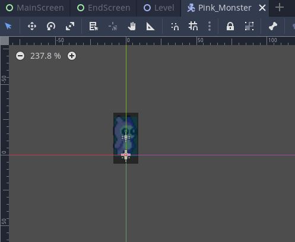

#### Enemy Scene in Godot Workspace   

#### Coin Objective Scene in Godot Workspace:  
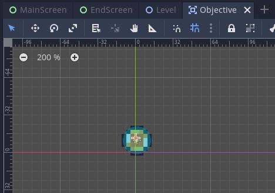

### Teleport Scene in Godot Workspace:
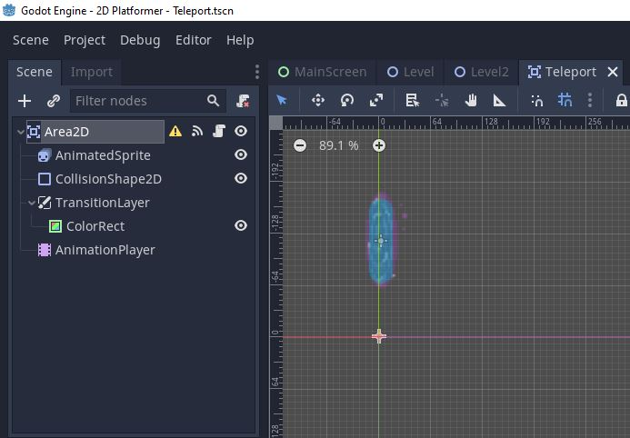

### Level 1 in Godot Workspace:
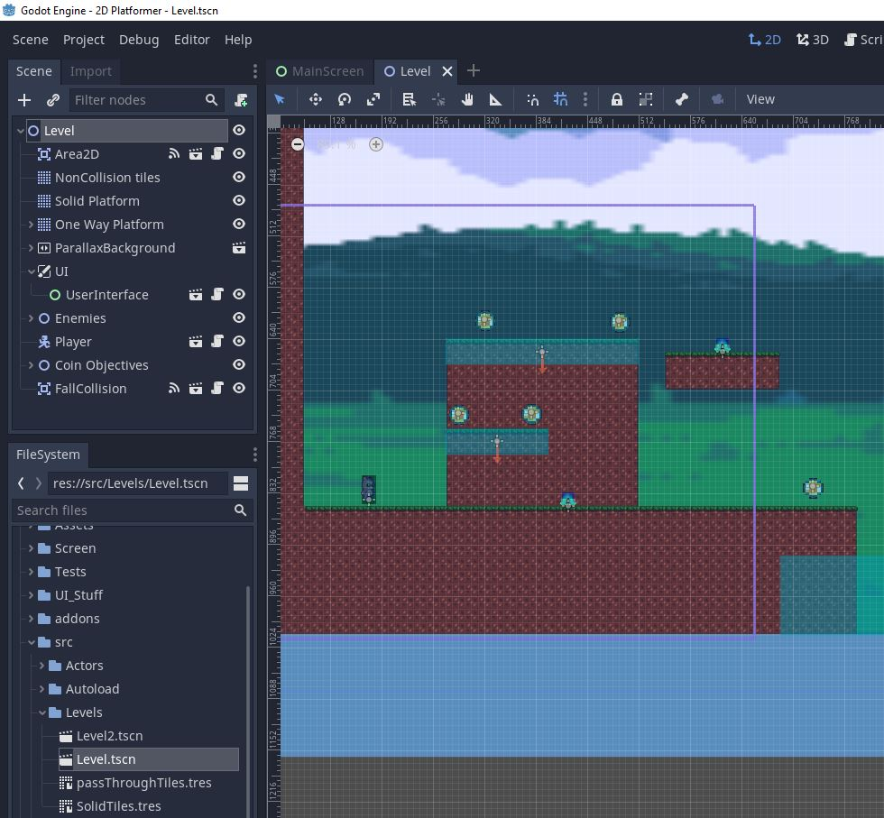

### Level 2 in Godot Workspace:
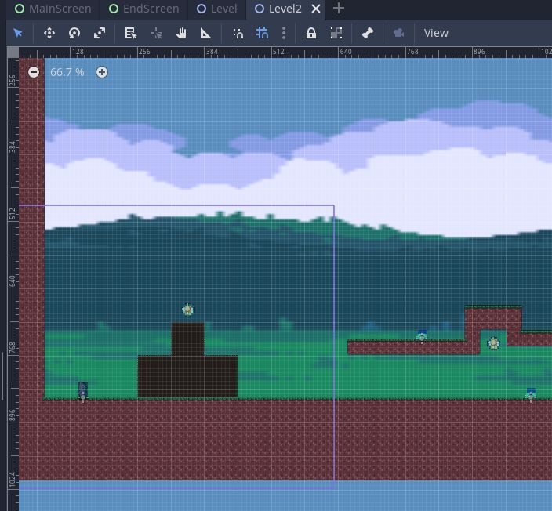

#### Level1 Being Run Example:  
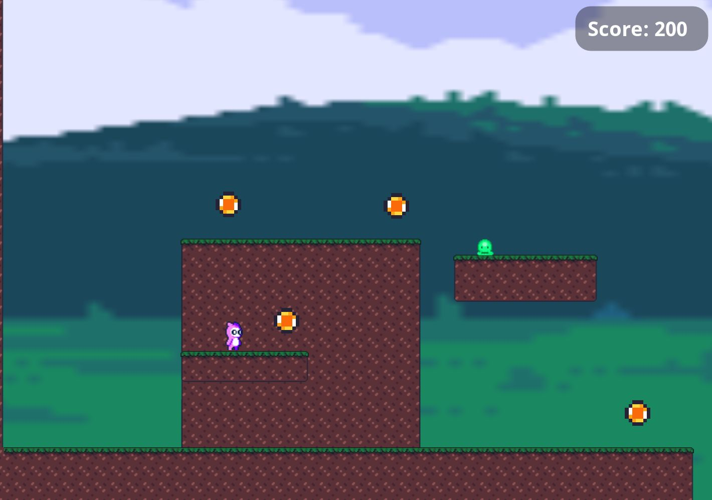

#### Death Screen (when player dies):  
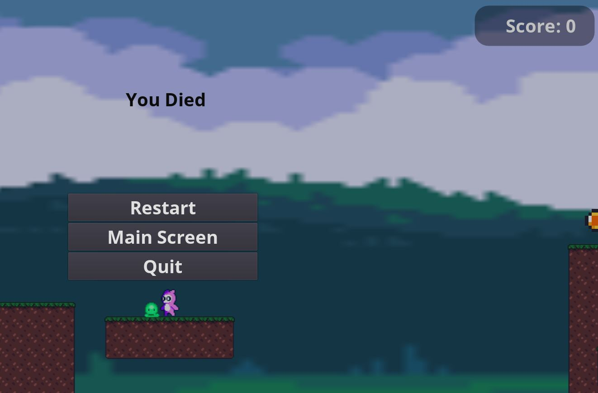

### Main Menu Scene in Godot Workspace:
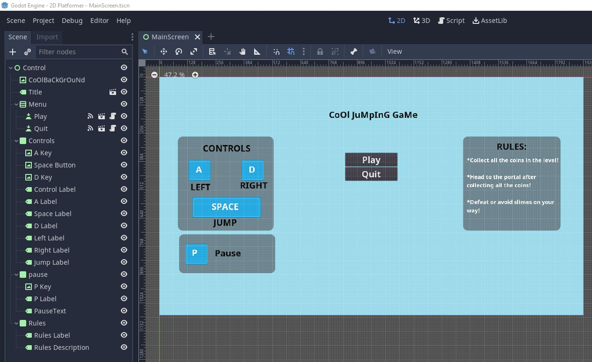

#### Main Menu (First Screen loaded when running game):  
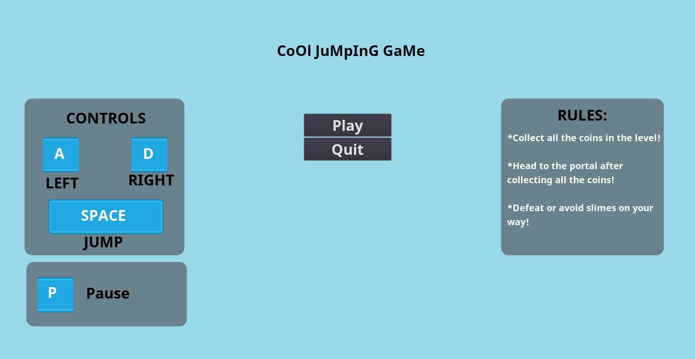

#### Pause Screen (player presses 'P'):  
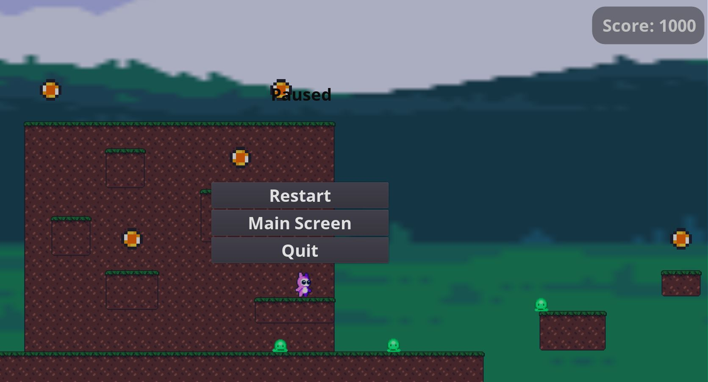

### End Screen Scene in Godot Workspace:
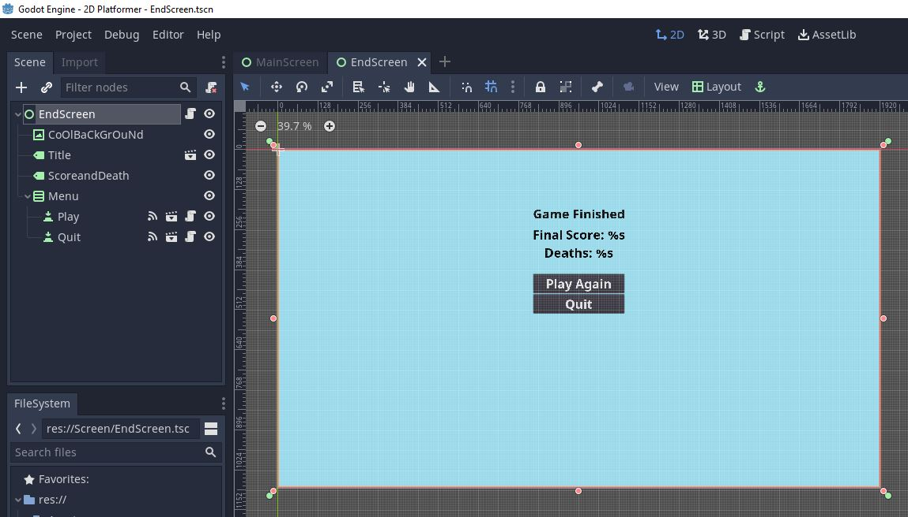

#### End Screen (player reaches the end of the game):  
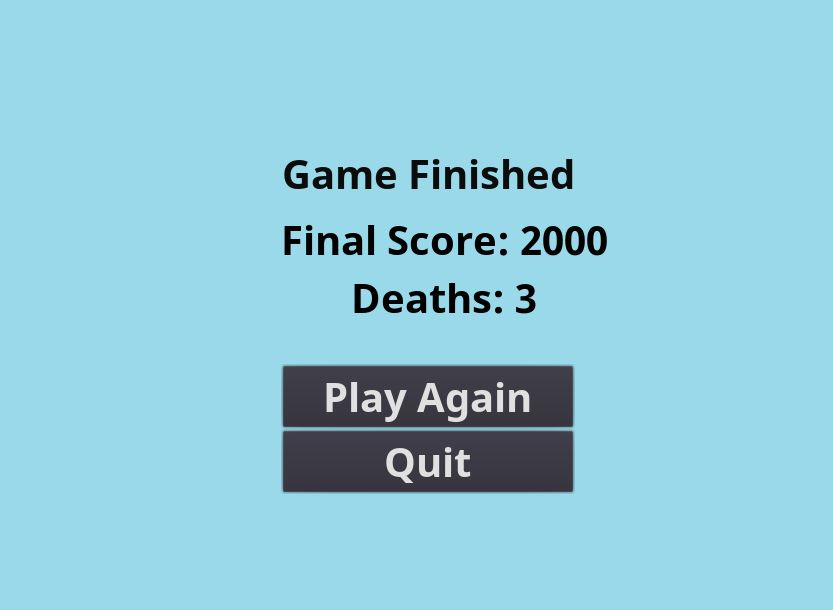

## Team Members 
* Minna Roberto 
* Timothy Pasion
* Ziyan Zhang
* Precious Wangwe

## Credits
Here are the credits to the artist's assets that were used in the game:

Player’s character:  
Artist: Craftpix.net  
https://free-game-assets.itch.io/free-tiny-hero-sprites-pixel-art  

Enemy characters:  
Artist: cactusturtle  
https://cactusturtle.itch.io/  

Tileset for Platforms, Background images, and coins  
Artist: MamaNeZakon  
https://mamanezakon.itch.io/forest-tileset   

Menu screen boxes  
Artist: Kenny  
https://opengameart.org/content/ui-pack  

Jump and coin collection sounds  
Artist: Kenny  
https://opengameart.org/content/interface-sounds  
